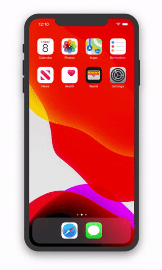
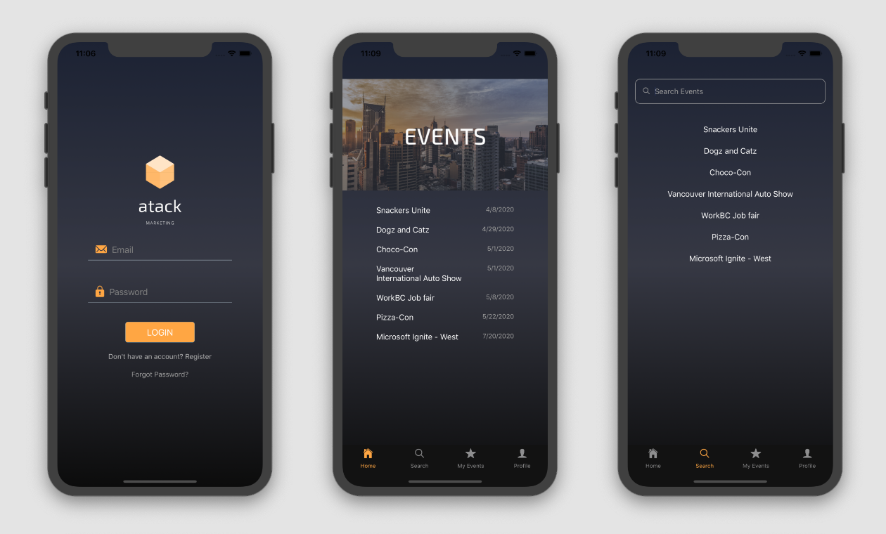
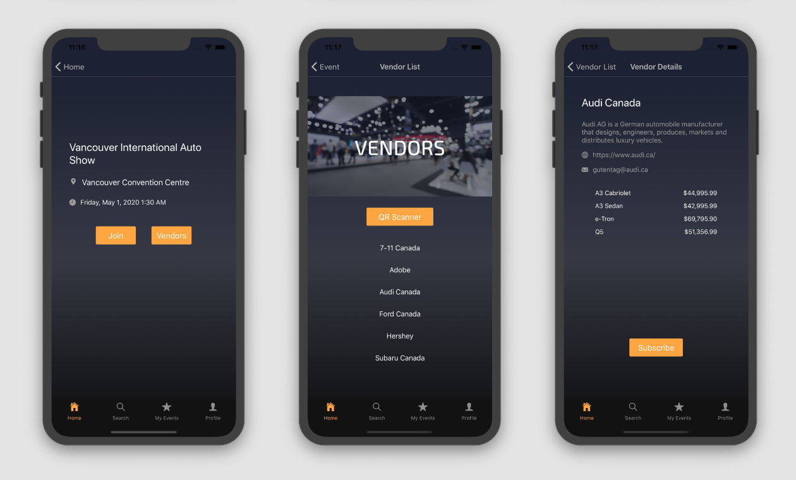
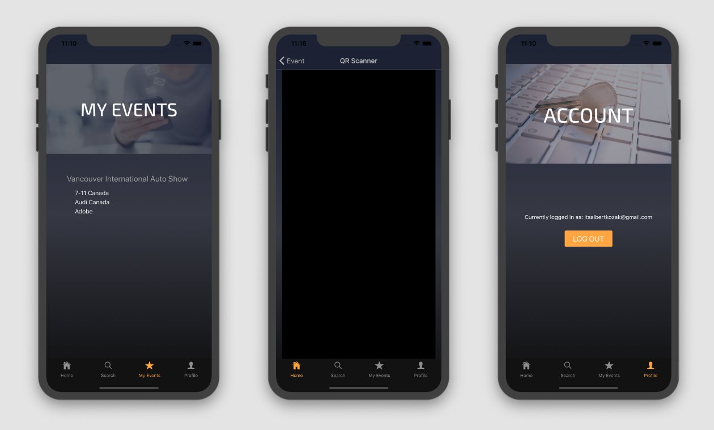

# Industry - SSD
A React Native and .NET Marketing Application created by Athena, Tony, Albert, Crystal, Kasra. Copyright 2020.

  
## Features
User Profile:
- Register
- Login

QR Scanner:
- Implements camera to scan vendor QR codes and subscribe

Search / View Event:
- Search for events
- Users can join and leave events
- View vendors
- Manually subscribe to vendors
- Information displayed in a detailed view

## Technologies
- React Native
- .NET
- Adobe XD

## Application Prototype
[View the full prototype on Adobe XD](https://xd.adobe.com/view/af850f75-0f9d-414c-6f33-cc7305f76382-d9b4/)

## Mobile App

## What's Next?
- Vendor logo images
- List views with sorting feature
- Pull to refresh
- Unsubscribe from subscription list
